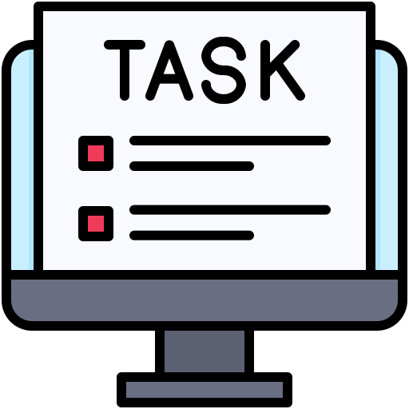

# My C# .NET Windows Forms Projects

Welcome to my repository showcasing three different C# .NET Windows Forms applications: **TaskFlow**, **RCP-Game**, and **Pizza-Delivery**. Each project demonstrates my proficiency in building robust and user-friendly desktop applications using the .NET framework.

**Note: All projects are currently in Beta and are still under development. They are not yet complete.**

## Projects Overview

### 1. TaskFlow



**TaskFlow** is a productivity application designed to help users manage their tasks efficiently. Key features include:

- **Task Creation**: Add, edit, and delete tasks.
- **Task Categorization**: Organize tasks by categories.
- **Priority Setting**: Assign priority levels to tasks.
- **Deadline Management**: Set deadlines and receive notifications.

### 2. RCP-Game


**RCP-Game** is an interactive Rock-Paper-Scissors game that allows users to play against the computer. Key features include:

- **User vs Computer Gameplay**: Choose between rock, paper, or scissors and compete against the computer.
- **Score Tracking**: Keeps track of the number of wins, losses, and ties.
- **User Interface**: Simple and intuitive UI for seamless gameplay.

### 3. Pizza-Delivery


**Pizza-Delivery** is a mock application for managing pizza delivery orders. Key features include:

- **Order Management**: Create, edit, and delete pizza orders.
- **Customer Information**: Store and manage customer details.
- **Pizza Customization**: Customize pizzas with various toppings and sizes.
- **Order Tracking**: Track the status of each order from preparation to delivery.

## Getting Started

To get started with any of these projects, follow the instructions below:

### Prerequisites

- [.NET Framework](https://dotnet.microsoft.com/download/dotnet-framework) (version 4.7.2 or later)
- [Visual Studio](https://visualstudio.microsoft.com/) (2019 or later)

### Installation

1. Clone the repository:
    ```bash
    git clone https://github.com/yourusername/your-repo-name.git
    ```

2. Navigate to the project directory of the application you want to run:
    ```bash
    cd your-repo-name/TaskFlow
    ```
    or
    ```bash
    cd your-repo-name/RCP-Game
    ```
    or
    ```bash
    cd your-repo-name/Pizza-Delivery
    ```

3. Open the project solution file (.sln) with Visual Studio.

4. Build the solution and run the project.

## Usage

Detailed usage instructions for each application are provided within the respective project folders. Refer to the `README.md` files in each project directory for more information.

## Contributing

If you would like to contribute to these projects, please follow these steps:

1. Fork the repository.
2. Create a new branch:
    ```bash
    git checkout -b feature/your-feature-name
    ```
3. Make your changes.
4. Commit your changes:
    ```bash
    git commit -m 'Add some feature'
    ```
5. Push to the branch:
    ```bash
    git push origin feature/your-feature-name
    ```
6. Open a pull request.

## License

This repository is licensed under the MIT License. See the [LICENSE](LICENSE) file for more information.

## Contact

If you have any questions or feedback, feel free to contact me at [mdelhajajipro2007@gmail.com](mailto:mdelhajaji2000@gmail.com).

---

All Those Projects Arent Completed Yet..!

---

Thank you for visiting my repository! Enjoy exploring the projects.
